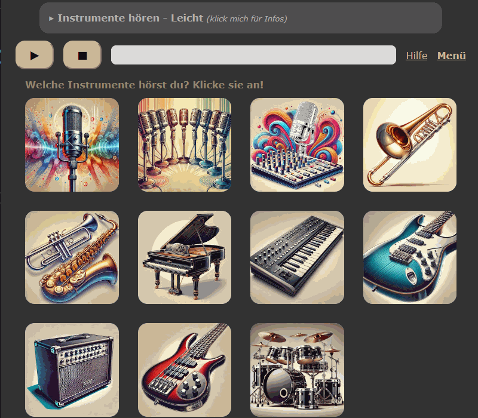

# Patchwerk Multitrack Ear Training

In dieser App können Songs gehört und einzelne Instrumente an- und ausgestellt werden. Zunächst als Übung und dann als Test schult dies das musikalische Hören. Schüler können durch das eigene Erfahren schnell einzelne Instrumente aus komplexen Songs heraushören und typische Besetzungen identifizieren.


## 🚀 Demo
### Spielerisch erkunden


### Test bestehen



## 📦 Features
- Über 30 Songs der Genres EDM, Orchester, Hip-Hop, Indie, Jazz, Metal, Pop und Rock
- Offene Spielwiese zum motivierten Ausprobieren und Erfahrungen sammeln
- Didaktisch sinnvolle "Tests" in angepassten Schwierigkeitsstufen
- Simulation von Effektgeräten mit mehreren Audioquellen
- Nutzbar an allen internetfähigen Endgeräten
- DSGVO-konform und ohne Login


## 🛠️ Setup

Es muss ein .tar-Image auf den Server geladen und mit einer Compose-Datei gestartet werden. Dafür multitrack.tar und compose.yaml in einen Ordner auf dem Server ablegen und dort (z. B. per CLI) folgende Befehle ausführen:

```bash
sudo docker load -i multitrack.tar
sudo docker compose up -d
```

### Image 
- Repo klonen und Docker-Image (**multitrack.tar**) erstellen und auf den Server laden
- .tar-Datei aus dem Release herunterladen


### Docker Compose:
```bash

services:
  multitrack:
   image: multitrack
    restart: unless-stopped
    ports:
      - "44222:8000"
```

## 📄 Lizenzen
Das Audiomaterial wurden von "Cambridge Music Technology" veröffentlicht und sind für nicht-kommerzielle Zwecke frei zu nutzen.
https://www.cambridge-mt.com/ms/mtk/


## Hinweise

Für die Darstellungen der Instrumente wurden K.I.-generierte Bilder benutzt. Diese geben Gesprächsanlässe für aufmerksame Schüler, da nicht alle Instrumente fehlerfrei dargestellt werden. Oft fallen die Fehler selbst der Lehrkraft zunächst nicht auf. 

Die Tests bieten den "Hilfe"-Button, der die Namen der Instrumente einblendet. Insbesondere bei Effekten (z. B. "Hall") kann dies sehr hilfreich sein. 

Die Tests unterscheiden sich darin, ob die erratenen Instrumente ausgeschaltet werden. Beim leichten Test verstummen die Instrumente, sobald sie erkannt wurden. So bleiben nur unerkannte Instrumente übrig und können gehört werden.
Beim schweren Test wird zudem der Button "Joker" eingeblendet. Die Instrumente spielen weiter, auch wenn sie korrekt erkannt wurden. Einmalig können mittels Joker alle bisher erkannten Instrumente ausgeschaltet werden.

Die Domain eines Tests bleibt ständig gleich. Jedes mal wird beim laden ein zufälliger Song ausgewählt.